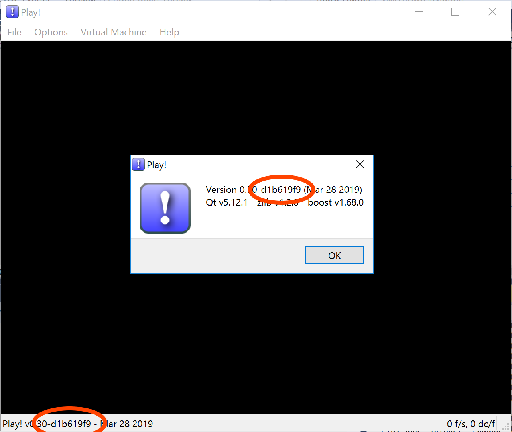

# Play! - Compatibility Tracker

This is the official [Play!](https://github.com/jpd002/Play-) compatibility tracker. Based on the same concept for cxbx: https://github.com/Cxbx-Reloaded/game-compatibility.

# Discord
You can join the official Discord with this link https://discord.gg/HygQnQP. When in doubt about any information you want to report, that's the best place to ask and for general discussion about the project in general.

# Guidelines

The games can be tested on either platform, but you can add the info about the platform it was tested on in the report. The compatibility should be more or less the same for every supported platform. If there's conflicting reports about a game's status on different platforms it probably means there's a platform specific bug that should be addressed differently than a compatibility issue. In that case, please open an issue on the main repository.

The commit hash of the build you're using can be found in the About dialog.

The games can be tested on the build you've made yourself. Just specify the commit hash of your build in the report.

# Game statuses

IMPORTANT NOTE 1: please, be sure that the information you are reporting is 100% verified against the status descriptions below. This information it's what other users rely on to understand which games work and how well they work.

IMPORTANT NOTE 2: when in doubt, just open any valid issue that already has a label added with the status (invalid or not verified issues aren't given any status label) and follow the example. Example of valid issue: https://github.com/jpd002/Play-Compatibility/issues/1212

**state-playable** means that the game is fully playable. It's important to notice that you _can't use_ external save files to progress beyond some parts where the emulator itself would have a gamebreaking issue (if you need a save to bypass an issue, the game isn't playable). For games where saving/loading is mandatory to keep your progress in some meaningful way, not being able to save also makes the game _not playable_.

**state-ingame** means somewhat playable past title screens (including with graphics bugs, crashes, saving, loading and other major problems).

**state-intro** means nothing but an intro/opening of the game is shown (such as a video/animation/company name/etc.).

**state-loadable** means that the game is capable of being read but can't actually start/run yet. If the game is at least _trying to run some frames_ (framerate is anything other than zero), should be reported as _loadable_ and not _nothing_.

**state-nothing** means that the game won't even be read by the emulator and/or crashes the emulator before the game even gets to show much of anything.
